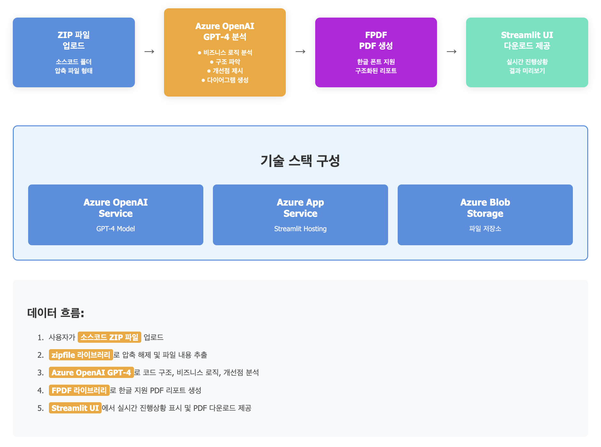

# ✅ **프로젝트 : 지능형 소스코드 분석 및 문서화 자동화 시스템**

## 📌 **개요 및 목적**
Azure OpenAI Service와 Streamlit을 활용하여 소스코드를 자동으로 분석하고, 비즈니스 로직 파악, 구조 분석, PDF 리포트 자동 생성을 수행하는 AI 기반 코드 분석 시스템입니다.

* 레거시 코드 분석 및 문서화 자동화
* 신규 개발자 온보딩 시간 단축  
* 코드 리뷰 효율성 향상
* 기술 부채 식별 및 개선점 제시

## 🔧 **활용 기술 및 Azure 서비스**
* **Azure OpenAI Service (GPT-4)**: 소스코드 분석, 자연어 기반 구조/로직 요약
* **Azure App Service**: Streamlit 웹 애플리케이션 호스팅
* **Azure Blob Storage**: 소스코드 파일 및 분석 결과 저장

## 🧩 **아키텍처**
<!-- ```
[소스코드 폴더 업로드] → [Python glob을 통한 파일 수집(.py, .java, .js 등)] → 
[Azure OpenAI GPT-4 분석] → [비즈니스 로직/구조/개선점 요약] → 
[FPDF 라이브러리로 PDF 생성] → [Streamlit UI에서 다운로드 제공]
``` -->


## 🎯 **기대 효과**
* 코드 문서화 시간 평균 감소 (수동 작성 → AI 자동 생성)
* 신규 개발자 코드 이해 시간 단축
* 코드 리뷰 준비 시간 감소
* 기술 부채 가시화를 통한 리팩토링 우선순위 명확화

## ⚠️ **구현 시 고려사항**
* OpenAI API 토큰 제한으로 인한 대용량 파일 분할 처리 필요
* 소스코드 내 민감 정보 필터링 (API 키, 패스워드 등)
* 다국어 폰트 지원을 위한 PDF 생성 라이브러리 설정 최적화